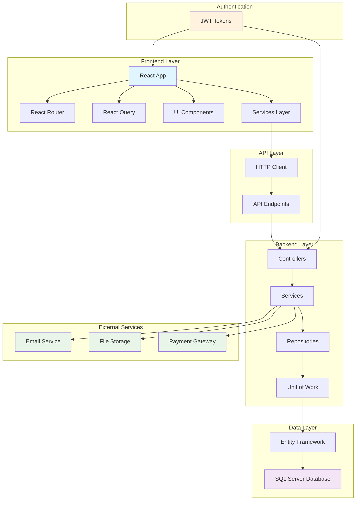

# 🏗️ Electronic Hub - بنية المشروع الشاملة

## 📋 نظرة عامة

**Electronic Hub** هو نظام إدارة متجر إلكترونيات متكامل مبني باستخدام أحدث التقنيات، يوفر إدارة شاملة للمنتجات، الفواتير، الموردين، والمبيعات مع واجهة مستخدم حديثة ومتجاوبة.

---

## 🎯 الهدف من المشروع

تطوير نظام إدارة متجر إلكترونيات شامل يوفر:
- إدارة المنتجات والمخزون
- نظام نقاط البيع (POS)
- إدارة فواتير المبيعات والشراء
- إدارة الموردين والعملاء
- تقارير وإحصائيات مفصلة
- نظام مستخدمين وصلاحيات

---

## 🏗️ البنية المعمارية

### 1. Frontend (واجهة المستخدم)

#### التقنيات المستخدمة:
- **React 18** - مكتبة واجهة المستخدم
- **TypeScript** - لضمان نوع البيانات
- **Vite** - أداة البناء السريعة
- **Tailwind CSS** - إطار عمل CSS
- **Shadcn/ui** - مكتبة مكونات UI
- **React Query** - إدارة البيانات والتخزين المؤقت
- **React Router** - التنقل بين الصفحات
- **Lucide React** - مكتبة الأيقونات

#### هيكل المجلدات:
```
Frontend/
├── src/
│   ├── components/          # المكونات المشتركة
│   │   ├── ui/             # مكونات UI الأساسية
│   │   ├── layout/         # مكونات التخطيط
│   │   └── forms/          # مكونات النماذج
│   ├── pages/              # صفحات التطبيق
│   │   ├── sales/          # صفحات المبيعات
│   │   ├── purchases/      # صفحات المشتريات
│   │   ├── inventory/      # صفحات المخزون
│   │   ├── suppliers/      # صفحات الموردين
│   │   └── dashboard/      # لوحة التحكم
│   ├── services/           # خدمات API
│   ├── contexts/           # React Contexts
│   ├── hooks/              # Custom Hooks
│   ├── utils/              # وظائف مساعدة
│   └── config/             # إعدادات التطبيق
```

#### المكونات الرئيسية:
- **DashboardLayout** - التخطيط الرئيسي للتطبيق
- **Sidebar** - الشريط الجانبي للتنقل
- **Header** - رأس الصفحة
- **AuthProvider** - إدارة المصادقة
- **ThemeProvider** - إدارة الثيمات

---

### 2. Backend (الخادم)

#### التقنيات المستخدمة:
- **ASP.NET Core 9.0** - إطار عمل الويب
- **Entity Framework Core** - ORM لقاعدة البيانات
- **SQL Server** - قاعدة البيانات
- **JWT Authentication** - المصادقة
- **AutoMapper** - تحويل البيانات
- **Swagger** - توثيق API

#### البنية المعمارية (Clean Architecture):
```
Backend/
├── ElectronicsStore.Domain/           # طبقة النطاق
│   ├── Entities/                     # الكيانات
│   ├── Interfaces/                   # الواجهات
│   └── Enums/                        # التعدادات
├── ElectronicsStore.Application/      # طبقة التطبيق
│   ├── Services/                     # الخدمات
│   ├── DTOs/                         # كائنات نقل البيانات
│   ├── Interfaces/                   # واجهات الخدمات
│   └── Mappings/                     # تحويل البيانات
├── ElectronicsStore.Infrastructure/   # طبقة البنية التحتية
│   ├── Data/                         # إعدادات قاعدة البيانات
│   ├── Repositories/                 # مستودعات البيانات
│   └── Services/                     # خدمات البنية التحتية
└── ElectronicsStore.WebAPI/          # طبقة الواجهة
    ├── Controllers/                  # وحدات التحكم
    ├── Middleware/                   # البرمجيات الوسطية
    └── Configuration/                # الإعدادات
```

#### الأنماط المستخدمة:
- **Repository Pattern** - نمط المستودع
- **Unit of Work Pattern** - نمط وحدة العمل
- **Strategy Pattern** - نمط الاستراتيجية
- **Observer Pattern** - نمط المراقب
- **Facade Pattern** - نمط الواجهة

---

### 3. قاعدة البيانات

#### الجداول الرئيسية:
- **users** - المستخدمين
- **roles** - الأدوار
- **permissions** - الصلاحيات
- **categories** - الفئات
- **suppliers** - الموردين
- **products** - المنتجات
- **customers** - العملاء
- **sales_invoices** - فواتير المبيعات
- **sales_invoice_details** - تفاصيل فواتير المبيعات
- **purchase_invoices** - فواتير الشراء
- **purchase_invoice_details** - تفاصيل فواتير الشراء
- **inventory_logs** - سجلات المخزون

#### العلاقات:
- كل منتج مرتبط بفئة ومورد
- كل فاتورة مبيعات مرتبطة بعميل ومستخدم
- كل فاتورة شراء مرتبطة بمورد ومستخدم
- كل فاتورة تحتوي على تفاصيل متعددة
- كل تفصيل مرتبط بمنتج

---

## 🔄 تدفق البيانات

### 1. المصادقة والتفويض
```
المستخدم → Frontend → JWT Token → Backend → قاعدة البيانات
```

### 2. العمليات CRUD
```
Frontend → API Service → Controller → Service → Repository → قاعدة البيانات
```

### 3. إدارة الحالة
```
React Query → API Calls → Backend → Response → Cache → UI Update
```

---

## 📱 الصفحات والوظائف

### 1. لوحة التحكم (Dashboard)
- إحصائيات عامة
- رسوم بيانية للمبيعات
- آخر العمليات
- تنبيهات مهمة

### 2. إدارة المنتجات
- عرض المنتجات
- إضافة/تعديل/حذف منتج
- إدارة المخزون
- البحث والفلترة

### 3. نقاط البيع (POS)
- واجهة بيع سريعة
- إضافة منتجات للسلة
- حساب المجموع
- طباعة الفاتورة

### 4. فواتير المبيعات
- عرض الفواتير
- إنشاء فاتورة جديدة
- تعديل/حذف فاتورة
- عرض التفاصيل

### 5. فواتير الشراء
- عرض فواتير الشراء
- إنشاء فاتورة شراء
- إدارة الموردين
- تتبع المشتريات

### 6. إدارة الموردين
- عرض الموردين
- إضافة/تعديل/حذف مورد
- تتبع المشتريات
- إحصائيات الموردين

### 7. إدارة العملاء
- عرض العملاء
- إضافة/تعديل/حذف عميل
- تتبع المشتريات
- إحصائيات العملاء

### 8. التقارير والإحصائيات
- تقارير المبيعات
- تقارير المشتريات
- تقارير المخزون
- تحليلات الأداء

---

## 🔐 الأمان

### 1. المصادقة
- JWT Tokens
- Refresh Tokens
- Session Management

### 2. التفويض
- Role-based Access Control (RBAC)
- Permission-based Access
- Route Protection

### 3. حماية البيانات
- Input Validation
- SQL Injection Prevention
- XSS Protection
- CSRF Protection

---

## 🚀 الأداء والتحسين

### 1. Frontend
- Code Splitting
- Lazy Loading
- React Query Caching
- Optimistic Updates

### 2. Backend
- Database Indexing
- Query Optimization
- Connection Pooling
- Caching Strategies

### 3. قاعدة البيانات
- Proper Indexing
- Query Optimization
- Database Triggers
- Computed Columns

---

## 🧪 الاختبار

### 1. Frontend Testing
- Unit Tests (Jest)
- Component Tests (React Testing Library)
- Integration Tests
- E2E Tests (Cypress)

### 2. Backend Testing
- Unit Tests (xUnit)
- Integration Tests
- API Tests
- Database Tests

---

## 📦 النشر والتوزيع

### 1. Frontend
- Build Optimization
- Static File Serving
- CDN Integration
- Environment Configuration

### 2. Backend
- Docker Containerization
- IIS Deployment
- Database Migration
- Environment Configuration

---

## 🔧 التطوير والصيانة

### 1. أدوات التطوير
- Visual Studio Code
- Visual Studio
- SQL Server Management Studio
- Postman (API Testing)

### 2. إدارة الإصدارات
- Git Version Control
- GitHub Repository
- Branching Strategy
- Code Review Process

### 3. المراقبة والتسجيل
- Application Logging
- Error Tracking
- Performance Monitoring
- User Analytics

---

## 📊 المخطط العام للتواصل



---

## 🎯 الميزات الرئيسية

### ✅ مكتملة
- [x] نظام المصادقة والتفويض
- [x] إدارة المنتجات والمخزون
- [x] نقاط البيع (POS)
- [x] فواتير المبيعات
- [x] فواتير الشراء
- [x] إدارة الموردين
- [x] إدارة العملاء
- [x] التقارير والإحصائيات
- [x] واجهة مستخدم متجاوبة
- [x] نظام البحث والفلترة

### 🔄 قيد التطوير
- [ ] نظام الإشعارات
- [ ] تصدير التقارير (PDF/Excel)
- [ ] نظام النسخ الاحتياطي
- [ ] تطبيق موبايل
- [ ] API للمطورين الخارجيين

### 📋 مخطط للمستقبل
- [ ] ذكاء اصطناعي للتنبؤات
- [ ] تكامل مع منصات التجارة الإلكترونية
- [ ] نظام إدارة الفروع
- [ ] نظام إدارة الموظفين
- [ ] تكامل مع أنظمة المحاسبة

---

## 📞 الدعم والمساعدة

### للمطورين:
- مراجعة الكود في GitHub
- توثيق API في Swagger
- اختبارات الوحدة والتكامل
- أدلة التطوير

### للمستخدمين:
- دليل المستخدم
- فيديوهات تعليمية
- نظام التذاكر
- دعم فني

---

## 📄 الترخيص

هذا المشروع مرخص تحت رخصة MIT. راجع ملف LICENSE للتفاصيل.

---

## 👥 المساهمون

- **فريق التطوير** - تطوير النظام
- **فريق التصميم** - تصميم واجهة المستخدم
- **فريق الاختبار** - اختبار الجودة
- **فريق DevOps** - النشر والصيانة

---

*آخر تحديث: يناير 2025*
